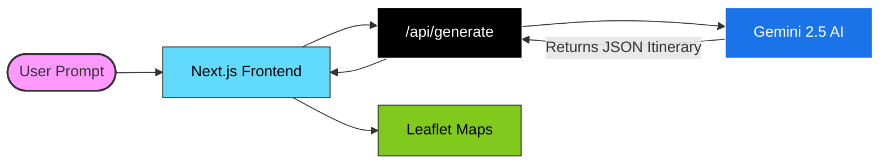

# TripEasy 🌍

TripEasy is a modern, AI-powered travel planner that generates highly customized, actionable travel itineraries in seconds. Designed with a premium, map-first interface, it allows users to chat with an AI assistant to plan, visualize, and refine their travel experiences intuitively.

---

## 🚀 Features

- **AI-Powered Itinerary Generation:** Simply type your destination, preferences, and constraints, and TripEasy builds a full day-by-day plan.
- **Interactive Map Integration:** View your entire trip on a dynamic Leaflet map. Route lines animate to show the flow of your travel day.
- **Auto-Expanding Side Sheets:** Click a map pin to instantly auto-scroll and expand the corresponding location card to see photos and detailed descriptions.
- **Conversational Refinement:** Want changes? Just type "Make day 2 cheaper" or "Add a museum on day 1". The AI instantly updates the itinerary while maintaining the stops you already like.
- **Rich Media Cards:** Location cards feature dynamic destination photos to help you visualize your trip.
- **Seamless UI/UX:** A beautiful, responsive interface featuring a white-themed marketing landing page, a dark-themed chat dashboard, and a split-pane itinerary board.
- **Voice Input:** Use the Web Speech API to talk to the travel planner instead of typing.
- **Export & Share:** Export your final itinerary as a clean, formatted PDF for offline access.

---

## 🏗️ Complete Architecture

TripEasy is built on a modern, serverless-first architecture optimized for speed, real-time AI generation, and a fluid, app-like user experience.

### Tech Stack
- **Frontend Framework:** Next.js 15 (App Router)
- **Language:** TypeScript (Strict Mode)
- **Styling:** Vanilla CSS (`globals.css`) + Tailwind CSS (hybrid approach)
- **Mapping:** Leaflet & `react-leaflet` (Dynamic client-side rendering)
- **Drag-and-Drop:** `@dnd-kit/core` & `@dnd-kit/sortable`
- **AI Integration:** `@google/genai` (Gemini 2.5 Flash) via Next.js Route Handlers
- **State Management:** React Hooks (`useState`, `useRef`, `useCallback`) + `localStorage` for session persistence

### Core Components Structure
```text
Trip-Planner/
├── app/
│   ├── page.tsx                 # Main orchestrator & state machine
│   ├── layout.tsx               # Root HTML layout and fonts
│   ├── globals.css              # Global styles, animations, and Tailwind imports
│   └── api/
│       ├── generate/route.ts    # POST endpoint for initial trip generation
│       └── refine/route.ts      # POST endpoint for conversational updates
├── components/
│   ├── PromptInput.tsx          # Marketing landing page & initial prompt
│   ├── Dashboard.tsx            # App interface, chat history, and voice input
│   ├── ItineraryBoard.tsx       # Split-pane workspace (List + Map)
│   ├── DayTabs.tsx              # Day navigation and draggable stops
│   ├── StopCard.tsx             # Expandable location cards with images
│   ├── MapPaneInner.tsx         # Leaflet map logic, animated routes, and markers
│   ├── RefinementBar.tsx        # Inline chat interface for AI refinement
│   └── LoadingSkeleton.tsx      # Shimmer UI shown during AI generation
├── lib/
│   ├── schema.ts                # Zod/Type definitions for the AI JSON output
│   └── utils.ts                 # Helper functions (e.g., ID generation)
└── types/
    └── itinerary.ts             # TypeScript interfaces for the application state
```

### Architecture Overview


### 1. The Entry Point (Landing State)
Users arrive at the white-themed, heavily animated landing page (`PromptInput.tsx`). They are greeted with parallax scrolling, floating destination cards, and a prominent search bar. 
- Typing a prompt here and hitting enter immediately navigates them to the App Dashboard, carrying their text with them.

### 2. The App Interface (Dashboard / Empty State)
The user enters `Dashboard.tsx`, a dark-themed, highly focused chat interface.
- It pulls up their recent trips from `localStorage`.
- Users can click filter pills (Where, When, Who, Budget) to construct their perfect prompt.
- The input supports **Web Speech API** for voice-to-text dictation.
- Submitting the prompt triggers `generate()` in `page.tsx`.

### 3. AI Generation (Loading State)
The UI transitions to a `LoadingSkeleton` while a `POST` request is fired to `/api/generate`.
- **Backend:** The Route Handler uses `gemini-2.5-flash` with `responseSchema` enforced. The model is strictly instructed to return a JSON object matching the `Itinerary` type.
- **Resilience:** If the API takes longer than 6 seconds, the UI escalates the loading message to assure the user the AI is "thinking deeply".

### 4. Interactive Workspace (Ready State)
Once the JSON is received, it is parsed, assigned unique IDs, and rendered in `ItineraryBoard.tsx`.
- **Left Pane:** Displays days as tabs. Stops are rendered as `StopCard` components that can be expanded to view AI-generated descriptions and photos. Stops can be drag-and-dropped using `@dnd-kit`.
- **Right Pane:** The `MapPaneInner` initializes Leaflet. It calculates map bounds based on hardcoded coordinates for major cities and renders SVG markers. Animated dashed lines (`.animated-route`) connect the stops in chronological order.
- **Interaction:** Clicking a map pin auto-scrolls the left pane to the corresponding `StopCard` and expands it.

### 5. Conversational Refinement (Refining State)
If the user isn't satisfied (e.g., "Make day 1 cheaper"), they use the `RefinementBar` at the bottom of the board.
- The current `Itinerary` JSON and the new text instruction are sent to `/api/refine`.
- The AI is instructed to modify the JSON structure while strictly maintaining the "name" of stops that shouldn't change.
- The client receives the diffed JSON, seamlessly swaps the state, and a success toast confirms the AI's changes.

---

## 🛠️ Getting Started

### Prerequisites
- Node.js (v18+)
- npm or pnpm

### Installation

1. Clone the repository.
2. Install dependencies:
   ```bash
   npm install
   ```
3. Set up environment variables. Create a `.env.local` file in the root directory and add your AI provider API keys (e.g., Gemini / OpenAI):
   ```env
   # Add necessary API keys here
   ```
4. Run the development server:
   ```bash
   npm run dev
   ```
5. Open [http://localhost:3000](http://localhost:3000) in your browser.

---

## 🎨 Design Philosophy

TripEasy is built to **"Wow"**. It avoids generic UI patterns in favor of:
- **Vibrant Colors & Gradients:** Used strategically to draw attention (e.g., loading states, active map pins).
- **Micro-animations:** Elements scale, fade, and pulse to provide immediate feedback.
- **Glassmorphism:** Frosted glass effects ensure text is readable while maintaining context of the map or background behind it.

## 📝 License
MIT License
